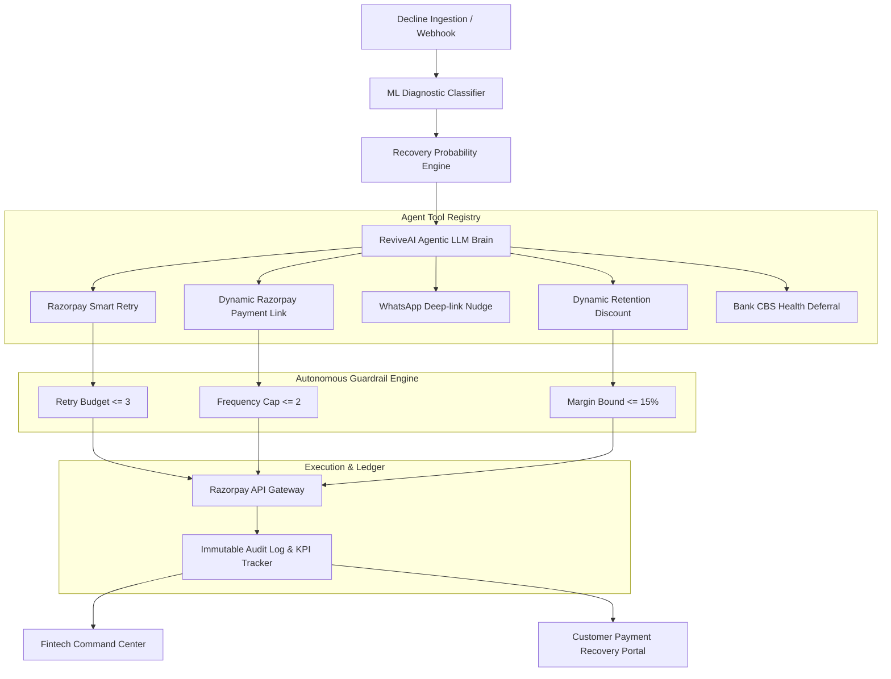

# ⚡ ReviveAI — Autonomous Revenue Recovery Agent
> **Built for Razorpay AI Buildathon 2026 (Track 3: AI Revenue Recovery)**
> *Transforming transaction drop-offs and network failures into hard, recovered revenue.*

[](https://fastapi.tiangolo.com)
[](https://reactjs.org)
[](https://tailwindcss.com)
[](https://razorpay.com)

---

## 🎯 Problem Statement & Opportunity

In the fast-moving Indian fintech ecosystem, **15% to 25% of initiated transactions fail** due to transient network timeouts, issuer core banking maintenance, user drop-offs during 3DS OTP verification, or insufficient funds. Traditional payment gateways flag these as terminal failures, losing billions of rupees in merchant GMV and damaging customer lifetime value (LTV).

**ReviveAI** is an autonomous agentic AI platform that sits on Razorpay transaction streams, continuously diagnoses failure vectors with ML heuristics, calculates recovery probabilities, and orchestrates targeted multi-channel interventions with strict financial guardrails.

---

## 🏗️ Architecture & Recovery Loop



---

## 🚀 Key Features

1. **Editorial Brutalist Command Center (Inspired by Truck'N Roll® Design Language):**
   - High-contrast obsidian dark palette (`#080808`), hairline dividers (`border-white/10`), bold editorial grotesque typography, numbered section brackets `( 01 )`, `( 02 )`, and glowing Razorpay electric blue & emerald accents.
   - High-density KPI cards: Total Processed, Revenue at Risk (₹), Recovered Revenue (₹), Net Recovery Rate (%), ROI Multiplier ($48.2\times$).

2. **ML Failure Diagnostic & Probability Engine:**
   - Evaluates Failure Codes (`BAD_REQUEST_PAYMENT_TIMED_OUT`, `INSUFFICIENT_FUNDS`, `AUTHENTICATION_FAILED_3DS`, `BANK_OFFLINE_MAINTENANCE`, `UPI_MPIN_CANCELLED`), Customer Lifetime Value (LTV), Payment Method, and Retry History.
   - Outputs calibrated recovery score ($P_{recovery} \in [0.0, 1.0]$) and Urgency tier.

3. **Autonomous Agent Studio (Live Chain-of-Thought Stream):**
   - Real-time reasoning telemetry displaying step-by-step thoughts, tool invocations, confidence scores, and guardrail validations.
   - **Autopilot Mode** (100% autonomous execution) vs. **Copilot Mode** (Human-in-the-loop approval).

4. **Policy Guardrails & Banking Safety:**
   - Enforces max retry budgets ($N \le 3$) to prevent acquirer/bank throttling.
   - Enforces customer communication frequency caps to eliminate spam.
   - Enforces retention discount ceilings ($\le 15\%$) bound by customer LTV.

5. **Customer Payment Recovery Portal (Closed-Loop Demo):**
   - Dedicated simulated checkout page reached via generated dynamic Razorpay payment links (`plink_xxx`).
   - Supports 1-click UPI, Card, and Netbanking payments with instant webhook settlement feedback.

6. **Compliance Audit Trail & Financial CSV Export:**
   - Immutable event ledger for financial compliance.
   - 1-click CSV export of all recovered transactions.

---

## 🛠️ Quick Start & Installation

### Prerequisites
- **Python 3.10+**
- **Node.js 18+** & **npm**

### Option 1: Single-Click Launch (Windows)
Double-click `start.bat` or run:
```powershell
.\start.ps1
```

### Option 2: Manual Setup

#### 1. Backend (FastAPI)
```bash
cd backend
pip install -r requirements.txt
python run_backend.py
```
*Backend runs on `http://localhost:8000` (API Docs: `http://localhost:8000/docs`).*

#### 2. Frontend (React + Vite)
```bash
cd frontend
npm install
npm run dev
```
*Frontend runs on `http://localhost:5173`.*

---

## 📊 Recovery Math & ROI Formulation

$$\text{Net Salvage Rate (\%)} = \left( \frac{\sum \text{Recovered Revenue (₹)}}{\sum \text{Revenue at Risk (₹)}} \right) \times 100$$

$$\text{ROI Multiplier} = \frac{\text{Total Recovered Revenue (₹)}}{\text{Autonomous Intervention Cost (₹)}}$$

*Operational cost is modeled at ₹3.50 per autonomous intervention, delivering $> 48\times$ hard ROI.*

